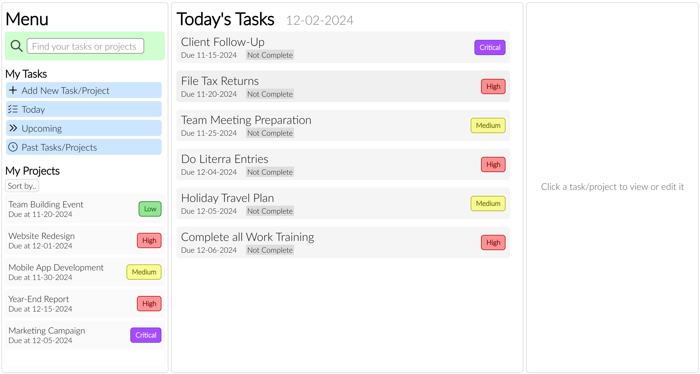

# To Do List/Task Manager

A simple Task Manager that can track and manage your tasks and projects.

## Table of Contents

- [Demo](#demo)
- [Preview](#preview)
- [Features](#features)
- [Technologies Used](#technologies-used)
- [Installation](#installation)
- [Usage](#usage)
- [Contributing](#contributing)
- [License](#license)

## Demo

<a href="https://zippy0626.github.io/to-do-list/" target="_blank" rel="noopener noreferrer">Live Demo</a>

## Preview



## Features

- Add tasks or projects
- See Today's Tasks, Upcoming Tasks, Past Tasks/Projects
- Task and Project Editing
- Project and task linking
- Task and Project Priorities
- Search for tasks and projects
- Project and task *sub*tasks
- A mostly modular design with JavaScript

## Technologies Used

- Frontend: HTML, CSS, JavaScript
- Backend: Local Storage API
- Other Tools: Webpack

## Installation

1. Clone this repository:
   ```bash
   git clone https://github.com/zippy0626/to-do-list.git
   ```
2. Navigate to the project directory:
   ```bash
   cd to-do-list
   ```
3. Install dependencies (if applicable):
   ```bash
   npm install
   ```
4. Build the project (if applicable):
   ```bash
   npm run dev
   ```

## Usage

- Click on the 'Add Task/Project' button to create a new task or a new project
- Click on any task or project to View it, or Edit it
- Use the Menu Section to search, or see tasks and projects for Today, Upcoming, or Past/Completed
- Sort projects with the 'Sort by' button
- Import or Export JSON data to back up or load in data

## Contributing

If you’d like to contribute:

1. Fork this repository.
2. Create a feature branch:
   ```bash
   git checkout -b feature-name
   ```
3. Commit your changes:
   ```bash
   git commit -m "Added some features"
   ```
4. Push to the branch:
   ```bash
   git push origin feature-name
   ```
5. Open a pull request.

## License

This project is licensed under the [MIT License](LICENSE).
